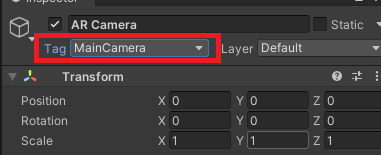

# Creating a scene for relocation with Stardust-SDK

In this page we are going to cover how to setup a scene for relocation. The steps are valid from a simple scene or a more complex one.

If your project already is setup with ARFoundation, you directly go to [this section](#setup-stardust-sdk-in-your-scene).

This project assumes that you already already created a map.

In order to create a map, you can download Stardust World Scale AR on the stores([__iOS App store__](https://apps.apple.com/us/app/stardust-world-scale-ar/id1551574766#?platform=iphone) or [__Android Play store__](https://play.google.com/store/apps/details?id=com.neogoma.stardust&pcampaignid=pcampaignidMKT-Other-global-all-co-prtnr-py-PartBadge-Mar2515-1)) and follow the [mapping instructions](quick_instruction.md).

The final result of this tutorial is available on [Github](https://github.com/Neogoma/simple-relocation-example).

## Setup AR foundation in your scene

In this tutorial we assume that you imported and setup AR Foundation in your project properly.

You can check the [Unity tutorial](https://learn.unity.com/tutorial/setting-up-ar-foundation) to setup your scene.

**DON'T FORGET** Once you setup your scene for AR, make sure to apply the **MainCamera** tag on the **AR Camera**  

## Setup Stardust SDK in your scene

Once ARFoundation has been setup you need to import the [latest package](https://github.com/Neogoma/stardust-SDK/releases/) from Github.

Download the Unity package and import it into your project via the following steps.

1. Navigate to Assets > Import package > Custom package

2. Select the package you downloaded from Github

3. Click on **Import** in the new window that just opened

4. If you did all the steps properly you should now see the assets in your project

## Import the prefabs in your scene.

1. Import the **NeogomaComponents** from __hobodream-sdk__ in your scene
2. Import the **StardustComponents** from __stardust-sdk__ in your scene
3. Once all imports are done, your hierarchy should look like that

4. Setup your **API Key** in the **StardustComponents** you can find your API key on the [dashboard](https://stardust.neogoma.com/profile)

Now that the project is setup and ready to go, let's write some code!