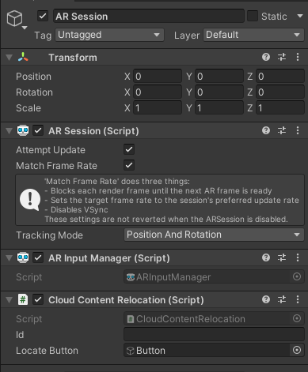

# Cloud content relocation

If you are on this page, it means that you plan to use the editor to edit the content in your map. It also means you will have to create the [Asset bundle system](../my_objects.md) to add new objects. 

The result of this tutorial is in the scene **1-Cloud Content** of the repository

Now that the project is setup we just have to write one class to manage all the data initialization for the map. We will start connecting our script with the [MapRelocationManager](developer/comp_map_relocation_manager.md). 

## Setup the script

First we need to prepare the script that will initialize the relocation manager.

1. Create a new script called **RelocationExample** 

2. Now delete the ```void Update()``` method and the attribute ```public string id;``` your class should now look like this

3. Create a method ```private void MapDownloaded(Session session, GameObject map)```. It will be called once the SDK finishes downloading the map from the server. Leave it empty for now.

```cs
using com.Neogoma.Stardust.API.Relocation;
using com.Neogoma.Stardust.Datamodel;
using UnityEngine;


public class RelocationExample : MonoBehaviour
{
    public string id;

    // Start is called before the first frame update
    void Start()
    {
       
    }

    private void MapDownloaded(Session session, GameObject map)
    {
        
    }
}
```

## Listen to MapRelocationManager

1. Set the ```private void MapDownloaded()``` function as a listener of **MapRelocationManager.onMapDownloadedSucessfully** in the ```void Start()``` function. Now your class should look like that

```cs
using com.Neogoma.Stardust.API.Relocation;
using com.Neogoma.Stardust.Datamodel;
using UnityEngine;

public class CloudContentRelocation : MonoBehaviour
{
    public string id;

    // Start is called before the first frame update
    void Start()
    {
        //Adding the listener
        MapRelocationManager.Instance.onMapDownloadedSucessfully.AddListener(MapDownloaded);
    }

    private void MapDownloaded(Session session, GameObject map)
    {
        
    }
}
```

2. Now keep in mind that you should **NOT RELOCATE BEFORE A MAP HAS BEEN DOWNLOADED**. This is why we listen to the **MapRelocationManager.onMapDownloadedSucessfully** event. Now you can add an button ```public GameObject locateButton;``` attribute and enable it when map has been downloaded!

```cs
using com.Neogoma.Stardust.API.Relocation;
using com.Neogoma.Stardust.Datamodel;
using UnityEngine;

public class CloudContentRelocation : MonoBehaviour
{
    public string id;

    public GameObject locateButton;

    // Start is called before the first frame update
    void Start()
    {
        //Safety here, make sure the button is not enabled until the map download is done
        locateButton.SetActive(false);

        //Adding the listener
        MapRelocationManager.Instance.onMapDownloadedSucessfully.AddListener(MapDownloaded);
    }

    private void MapDownloaded(Session session, GameObject map)
    {
        //The map is downloaded we can relocate now
        locateButton.SetActive(true);
    }
}
```

## Request the map download

Now we just have to request the map on start using the id with a call from ```MapRelocationManager.Instance.GetDataForMap``` (for more details check the [class overview](developer/comp_map_relocation_manager.md)). Your class will now look like this:

```cs
using com.Neogoma.Stardust.API.Relocation;
using com.Neogoma.Stardust.Datamodel;
using UnityEngine;

public class CloudContentRelocation : MonoBehaviour
{
    public string id;

    public GameObject locateButton;

    // Start is called before the first frame update
    void Start()
    {
        //Safety here, make sure the button is not enabled until the map download is done
        locateButton.SetActive(false);

        //Adding the listener
        MapRelocationManager.Instance.onMapDownloadedSucessfully.AddListener(MapDownloaded);

        //Start downloading the map
        MapRelocationManager.Instance.GetDataForMap(id);
    }

    private void MapDownloaded(Session session, GameObject map)
    {
        //The map is downloaded we can relocate now
        locateButton.SetActive(true);
    }
}
```

What will happen ?
* The script will download the map on start (you can edit the map directly on the dashboard).
* Once the map is downloaded it will activate the __locate__ button to allow the user to relocate.

## Setup the UI

Just create a button wherever you want in your scene. For this example I will create it in the middle of the screen.


## Assign your CloudContentRelocation to the ar session

Add the **CloudContentRelocation** script to the **AR Session** gameobject.
Once this is done, you can fill in the fields

1. Put your button as the attribute **Locate button** 
2. Fill in the id field with your **Map ID** of the [dashboard](https://stardust.neogoma.com/map_list)



## Call the relocation when you click on the button

Now it's time to finally assign the relocation to the button.

Select your button then in the **On Click()** event, assign the **StardustComponent** and select the **MapRelocationManager.LocateCurrentPosition()** function.

Your button inspector should look like this


## Build and run

That's it! You can now build and run your map and you just have to follow the [how to relocate](how_relocate) guide. You can now easily adapt this tutorial to your own project! Note that you can do all the steps programatically if you don't want to have a button for the relocation function.

For better user experience here are some suggestions:
* Listen to more [events](developer/comp_map_relocation_manager#events) to be able to tell the user what's going on (relocations results, start downloading the map...).
* You can hide the button after requesting a relocation and show it again after getting the relocation results (otherwise the user can receive different relocation results at different times).


