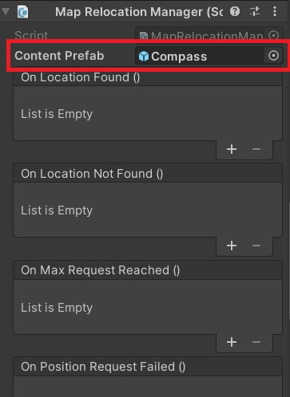

# Relocation script (LOCAL CONTENT)

If you are on this page, it means that you plan to use Unity to edit the content in your map.

The result of this tutorial is in the scene **2-Local content** of the repository


## Setup the script

First we need to prepare the script that will initialize the relocation manager.

1. Create a new script called **LocalContentRelocation** 

2. Now delete the ```void Update()``` method and the attribute ```public string uuid;``` your class should now look like this

```cs
using com.Neogoma.Stardust.API.Relocation;
using UnityEngine;

public class LocalContentRelocation : MonoBehaviour
{
    public string uuid;

    public void Start()
    {
        MapRelocationManager.Instance.onPositionFound.AddListener(PositionFound);
    }

    public void Relocate()
    {
        MapRelocationManager.Instance.LocateCurrentPosition(uuid);
    }
}
```

## Setup the UI

Just create a button wherever you want in your scene. For this example I will create it in the middle of the screen.


## Assign your LocalContentRelocation to the ar session

Add the **LocalContentRelocation** script to the **AR Session** gameobject.
Once this is done, fill in the id field with your **Map ID** of the [dashboard](https://stardust.neogoma.com/map_list)


## Assign your own local content to the Content prefab of Map Relocation Manager

Click on the StardustSDK prefab, then look for the Map Relocation Manager script. Then you can setup your **OWN** content as a "content prefab".




## Call the relocation when you click on the button

Now it's time to finally assign the relocation to the button.

Select your button then in the **On Click()** event, assign the **ARSession** and select the **LocalContentRelocation.Relocate()** function.

Your button inspector should look like this


## Build and run

That's it! You can now build and run your map and you just have to follow the [how to relocate](how_relocate) guide. You can now easily adapt this tutorial to your own project! Note that you can do all the steps programatically if you don't want to have a button for the relocation function.

For better user experience here are some suggestions:
* Listen to more [events](developer/classes_overview/comp_map_relocation_manager?id=events) to be able to tell the user what's going on (relocations results, start downloading the map...).
* You can hide the button after requesting a relocation and show it again after getting the relocation results (otherwise the user can receive different relocation results at different times).


