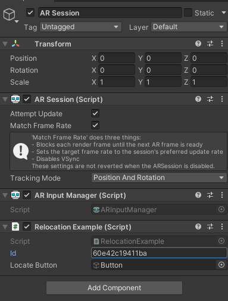
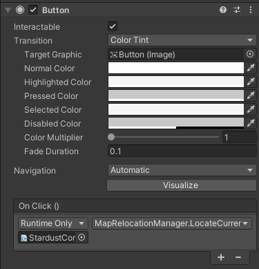

# Setting up the calls to relcoation

The script is now setup and the final step is now to create the UI, link it with and scripts and setup the necessary datas in the inspector!

## Setup the UI

Just create a button wherever you want in your scene. For this example I will create it in the middle of the screen.

## Assign your RelocationExample to the ar session

Add the **RelocationExample** script to the **AR Session** gameobject.
Once this is done, you can fill in the fields

1. Put your button as the attribute **Locate button** 
2. Fill in the id field with your **Map ID** of the [dashboard](https://stardust.neogoma.com/map_list)

## Call the relocation when you click on the button

Now it's time to finally assign the relocation to the button.

Select your button then in the **On Click()** event, assign the **StardustComponent** and select the **MapRelocationManager.LocateCurrentPosition()** function.

Your button inspector should look like this

## Build and run

That's it! You can now build and run your map and you just have to follow the [how to relocate](how_relocate) guide. You can now easily adapt this tutorial to your own project! Note that you can do all the steps programatically if you don't want to have a button for the relocation function.

For better user experience here are some suggestions:
* Listen to more [events](developer/comp_map_relocation_manager#events) to be able to tell the user what's going on (relocations results, start downloading the map...).
* You can hide the button after requesting a relocation and show it again after getting the relocation results (otherwise the user can receive different relocation results at different times).