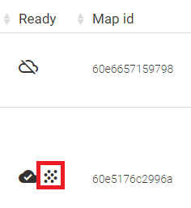
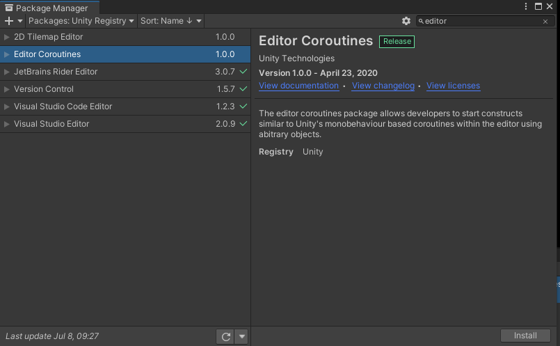

# Creating local content with Stardust-SDK

In this page we are going to cover how to create a scene locally **WITHOUT** using the Stardust Editor.

## Prerequisite 

1. A project and a scene **correctly configured**. If not, you can get a quick sample from [here](https://github.com/Neogoma/tutorial-simple-relocation) or please follow [this page](developer/0_1_empty_project.md).
2. We assume that you already **created and trained** a map. If you don't have a map yet, you can follow this [quick guide](quick_instruction.md) to create one.
3. In this tutorial we assume that the **point cloud was generated**. You can check if your map has a point cloud with the icon next to the training status in the dashboard.

## Install the editor coroutine in your project

The same way you installed AR Foundation, install the **Editor Coroutines** package in your project via the package manager.

Now that the project is setup and ready to go, let's get to work!