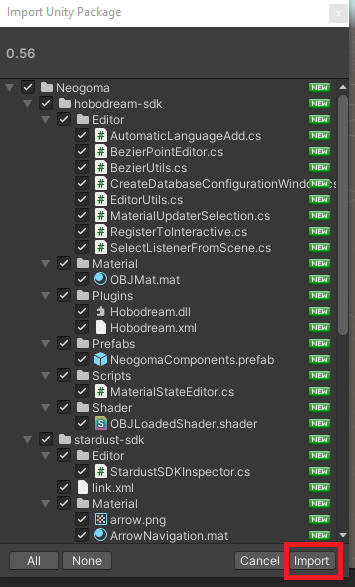
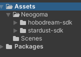
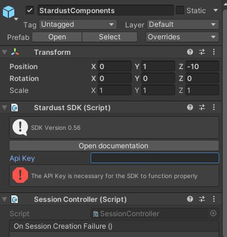

# Creating local content with Stardust-SDK

In this page we are going to cover how to create a scene locally **WITHOUT** using the Stardust Editor.

If your project already is setup with ARFoundation, you directly go to [this section](#setup-stardust-sdk-in-your-scene).

This project assumes that you already already created a map and that the point cloud for the map has been generated. You can confirm that the map has been generated if there is the point cloud icon on the dashboard.

In order to create a map, you can download Stardust World Scale AR on the stores([__iOS App store__](https://apps.apple.com/us/app/stardust-world-scale-ar/id1551574766#?platform=iphone) or [__Android Play store__](https://play.google.com/store/apps/details?id=com.neogoma.stardust&pcampaignid=pcampaignidMKT-Other-global-all-co-prtnr-py-PartBadge-Mar2515-1)) and follow the [mapping instructions](quick_instruction.md).

## Setup AR foundation in your scene

In this tutorial we assume that you imported and setup AR Foundation in your project properly.

You can check the [Unity tutorial](https://learn.unity.com/tutorial/setting-up-ar-foundation) to setup your scene.

## Install the editor coroutine in your project

The same way you installed AR Foundation, install the Editor Coroutines package in your project via the package manager.

## Setup Stardust SDK in your project

Once ARFoundation has been setup you need to import the [latest package](https://github.com/Neogoma/stardust-SDK/releases/) from Github.

Download the Unity package and import it into your project via the following steps.

1. Navigate to Assets > Import package > Custom package

2. Select the package you downloaded from Github

3. Click on **Import** in the new window that just opened

4. If you did all the steps properly you should now see the assets in your project

## Import the prefabs in your scene.

1. Import the **NeogomaComponents** from __hobodream-sdk__ in your scene
2. Import the **StardustComponents** from __stardust-sdk__ in your scene
3. Once all imports are done, your hierarchy should look like that

4. Setup your **API Key** in the **StardustComponents** you can find your API key on the [dashboard](https://stardust.neogoma.com/profile)

Now that the project is setup and ready to go, let's get to work!