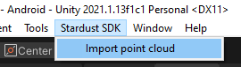
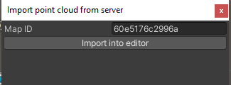
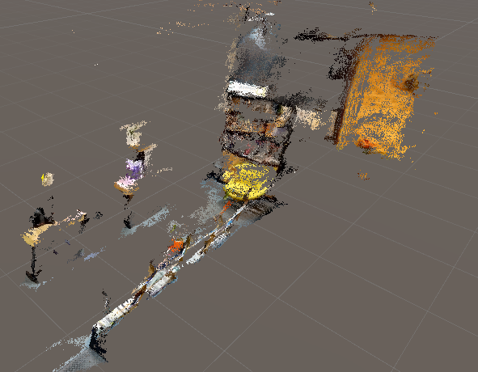
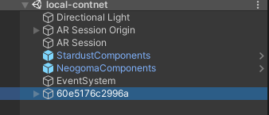
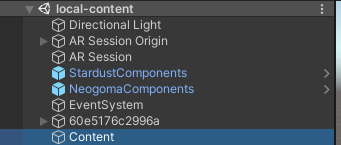
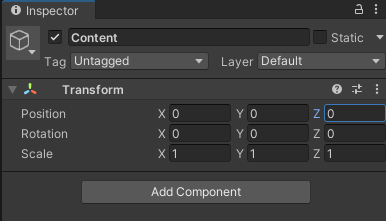

# Importing the point cloud and create your content

In this page we are going to cover how to create your own content locally without using the editor.

## Import the point cloud

First we import the point cloud in the scene, make sure you setup your API key in the **StardustSDK** component!

1. Select Stardust SDK > Import point cloud

2. In the window that just opened, fill in the id field with your **Map ID** of the [dashboard](https://stardust.neogoma.com/map_list)

3. After the loading, the point cloud should be visible in your scene. In the hierarchy it will be an object with the map ID.

  

The point cloud position should always be (0,0,0) and the rotation should also be (0,0,0). 

## Creating your own content locally

Now that we can see the point cloud we can create the virtual content

1. Create an **EMPTY** object at the **ROOT** of the scene and name it __Content__

2. Make sure that __Content__ coordnates are in (0,0,0) and rotation is (0,0,0) too

