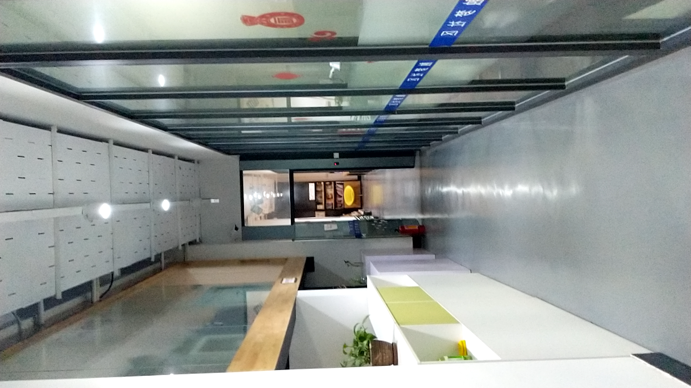

# Provide device image

If you are using a device that is not ARFoundation compatible, you can still relocate but you will need to write some code to your specific device behavior!

**NOTE**: This series tutorials will NOT provide full implementation but instead will wall you trough the structures because we consider each device will have different code


## Map compatibility
If you want your maps to be compatible with the maps generated from the apps on github or stores, you will need to take the picture in portrait mode and then rotate it left 90 degrees. Here is an example to verify (UP is on the LEFT side of the picture).




You can check the orientation of your picture by saving your texture on disk with the following function.
```cs
ImageHelper.SaveTextureOnDisk(Texture2D tex, string name, PictureType type);
```

## Create an event
First of all, you need to create the event to communicate the picture to the differents stardust modules. You need to create a class that will extend ```BaseInteractionEvent``` and implement ```IPictureDataReady```. This event will hold the pictures as a byte array (coming from the ``Texture2D.EncodeToJPG()`` function). 

```cs
using com.Neogoma.HoboDream;
using com.Neogoma.HoboDream.Impl;
using com.Neogoma.Stardust.API;

public class PictureEvent : BaseInteractionEvent, IPictureDataReady
{
    private byte[] data;

    public PictureEvent(IInteractiveElement source) : base(source, InteractiveEventAction.ARRIVED)
    {
    }

    public void SetData(byte[] data)
    {
        this.data = data;
    }

    public byte[] GetPictureDatas()
    {
        return data;
    }
}
```

## Create a camera image provider

Now we need to set up the class that will compute the image for the rest of the stardust components. You need to create a class that will extend ```AbstractNonMonoInteractive``` and implement ```ICameraImageProvider```. This class SHOULD compute the picture data and convert it into a byte array and dispatch it to the different modules.


```cs
using com.Neogoma.HoboDream.Impl;
using com.Neogoma.Stardust.API;

public class CustomImageProvider : AbstractNonMonoInteractive, ICameraImageProvider
{
    public void ComputeImageData()
    {
        //Create a new event
        PictureEvent picEvent=new PictureEvent(this);

        //Initialize a new array
        byte[] imageDatas=new byte[0];

        //Write the code to fill in the imageDatas array here with your own data feed
        //Remember to orient the picture properly!

        //Update the event with the array
        picEvent.SetData(imageDatas);

        //Dispatch the event to all the stardust modules
        NotifyListeners(picEvent);

    }

    public void InitializeCamera()
    {
        //Do what you need to initialize the camera here (for example: select the front/back camera )
    }

    public void SetQuality(ImageQuality quality)
    {
        //Do what you need to setup the right quality of the camera here (for example: select the resolution)
    }
}
```

Now that the basic structure is set for getting the image the next step will be to get the intrinsics!
