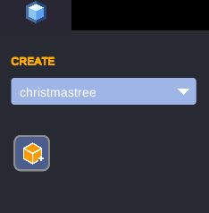
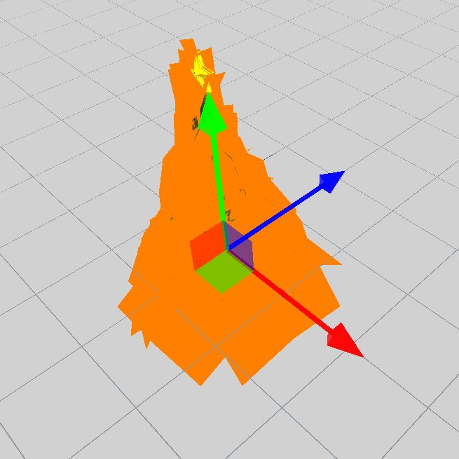
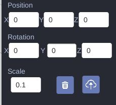
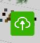

# Editor commands
## Camera movement
### Moving around
* W/Up: Forward
* S/Down: Backward
* A/Left: Left
* D/Right: Right
* Q: Move up
* E: Move down

### Rotating camera
Maintain ALT and move the mouse to turn the camera around.

### Pan the camera 
Middle click + moving the mouse to move the camera in the world

## Objects
### Creating object
Once you opened the editor you can create/delete/update objects. In order to create an object select the bundle you want to create in the combobox and then click on the create button.

### Manipulating an object
You can select an object just by clicking on it, then manipulation tools will appear.

To manipulate an object you can just use the manipulation tools inside the editor.

Or you can use the properties editor directly.

### Deleting an object/saving
You can delete an object with the delete button.

You can save the scene using the save button.

