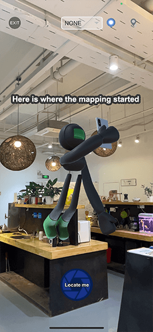

### **How to relocate ?**
Go to a place or near a place that you **already mapped** then try to relocate there.
Make sure you **stand still** when launching the relocation in order to avoid frame blurriness.

### **How do I know if I relocated properly ?**

In the Stardust World Scale AR demo app, we show a 3D avatar that tells you where you started mapping. If you created objects, after relocation they should be close to where you put them. Look for that guy!

Likely reasons you’ll have a FAILED relocation:
* Blurry pictures while mapping or relocating
* No enough frames uploaded while mapping
* Too few updates
* Trying to relocate in a place that has not been mapped 