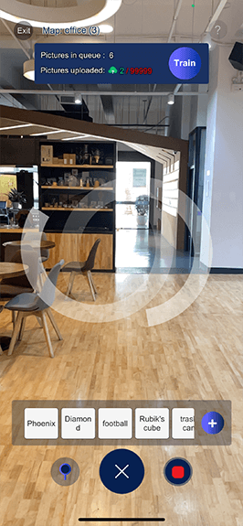
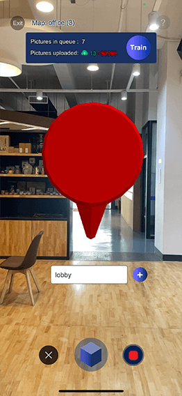

## **Basic theory**
Unlike previous versions, our mapping strategy is focused on collecting good quality data rather than a maximum of data. So the most important mapping instructions are:
* Avoid blurry pictures, make sure your camera (or mapping device such as drone, smart glasses, etc) correctly focuses.
* Walk slowly and avoid sharp turns to ensure that there are enough similarities between two frames 

## **Step by step explanations based on the Stardust World Scale AR app**
The demo apps are available on [__iOS App store__](https://apps.apple.com/us/app/stardust-world-scale-ar/id1551574766#?platform=iphone) and [__Android Play store__](https://play.google.com/store/apps/details?id=com.neogoma.stardust&pcampaignid=pcampaignidMKT-Other-global-all-co-prtnr-py-PartBadge-Mar2515-1). For Chinese users, please contact us directly if you need an APK. 

Login into the app with your Stardust account. Open the scene “create new map” and input a map name. We’ll automatically assign a name if you lack inspiration. We’ve noticed it’s best to name the map after the place you’re mapping, it will avoid confusion. 

You will then land on the data capture scene, where the origin should be where you stand. The origin is represented by X,Y,Z axis in blue, green and red. If you don’t see them, you should close the app and start over to recalibrate your phone, which probably lost tracking during a previous session. This origin is important as it will help you to evaluate the accuracy of the relocation. 

By clicking on the camera icon on the bottom right side of your screen, you will start mapping, which is another word to say regularly capturing the frames. The frames will be captured when we detect you moved in a significant way rather than at regular intervals. The current version is set to detect a movement of XXXcm or YYY degrees. Each frame taken will also trigger a photo capture animation on the camera icon and 2 numbers will start counting:

* Pictures in queue: this number represents every frame taken on your phone. They __DO NOT__ represent the final status of your map, but are an indication of how many frames you can still take until you’ll reach your tier limit.
* Pictures uploaded: represents the __frame successfully sent to the servers.__ We’re sending them by batch of 5 to servers in Singapore, so it might take a while. Bear with us, we’ll scale that for V1.0. Data are around 6 Mb each so if you are using mobile data, __make sure you have enough data in your plan.__

__You don't have to fill in all your picture quota to train the map (remember to keep some for the [update](update_instructions.md)).__

Once you think you uploaded enough pictures for your space (try to cover as much area as necessary), you can click on the __TRAIN__ button.

If you didn't fully fill in your quota you can [__update__](update_instructions.md) your map later.

## **Adding objects while mapping**
There are 2 ways to anchor 3D objects in your space: with the app while mapping or from the [__editor__](editor_commands.md). Creating objects while mapping is not only a good way to evaluate the accuracy of the relocation, but also to give you reference points for further creation. Just click on the + button to drop objects to your space. You can upload more objects from your dashboard, we are currently supporting .obj file and unity bundles.

## **Adding navigation targets while mapping**
Similar to objects creation, the app allows you to add destination targets while mapping. You need to name the targets first and click on + to add them in your space. After relocating, you will be able to navigate to each target independently.

## **Where and what to map**
__There is no physical limits to spaces you can map, but a couple of guidelines to keep in mind:__

* Similar to the way human eyes work, a camera can’t map or recognize a completely dark space
* Reflective surfaces will create different visual features based on your current viewpoint, which might not be correctly interpreted by our models
* Spaces with limited visual features such as a white wall or a hotel corridor with 200 similar doors will create issues. Again here, the human eye wouldn’t be able to know exactly where it is, computer vision works the same way. 
* Crowed places are not an issue but will require multiple updates. Similarly, objects that will frequently move, such as chairs, can be included in a bigger map that has at 4-5 updates. Even works with changing screens that are part of a bigger map.

The following drawing should cover most places you might be mapping. In this example, we’ve created a big map first, but you can decide to map smaller distinctive spaces and stitch them together later. The mapping technique is always the same, regardless of indoor and outdoor spaces.

While mapping and updating the map, what you’re trying to achieve is to **cover as many viewpoints as possible,** so that end-users will able to relocate with a high probability and accuracy. Remember, the more viewpoints the better accuracy and successful ratio!

As you can see below, the **first mapping in dark grey** was done to cover the main path. Along that path, multiple updates (different green colours) were added to include specific areas, **covering as many viewpoints as possible.** Our current model can estimate a relocation pose request up to 30° different from the dataset. Above that, the only solution to guarantee a successful relocation is a map update. 

Warning: if you pause your mapping, remember to start over where you took the last frame! If there is no overlap between 2 frames, both relocation and SFM algorithms won’t be able to work.

## **Mapping Examples**
### Good mapping example
The following video is a simple example of **GOOD MAPPING.**

[Good mapping](_videos/good_mapping.mp4  ':include :type=video')

The user walks slowly and turns the camera slowly during rotations.

### Bad mapping example
The following video is a simple example of **BAD MAPPING.**

[Bad mapping](_videos/bad_mapping.mp4 ':include :type=video')

### **What is wrong ?**

1. The user turned the camera fast so some frames will be low quality
2. The user was running while mapping which made frame inconsistent in quality
3. Because of the fast movements, maybe the SLAM data of the phones are also

