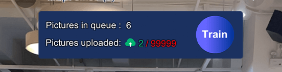

## Step by step explanations based on the Stardust World Scale AR app
The demo apps are available on [__iOS App store__](https://apps.apple.com/us/app/stardust-world-scale-ar/id1551574766#?platform=iphone) and [__Android Play store__](https://play.google.com/store/apps/details?id=com.neogoma.stardust&pcampaignid=pcampaignidMKT-Other-global-all-co-prtnr-py-PartBadge-Mar2515-1). For Chinese users, if you can't access trough playstore, you will have to build your  version from the [demo repository](https://github.com/Neogoma/stardust-SDK)!

Login into the app with your Stardust account. Open the scene “create new map” and input a map name. We’ll automatically assign a name if you lack inspiration. We’ve noticed it’s best to name the map after the place you’re mapping, it will avoid confusion. 

You will then land on the data capture scene, where the origin should be where you stand. The origin is represented by the X,Y,Z axis(blue, green and red). If you don’t see them, you should close the app and start over to recalibrate your phone, which probably lost tracking during a previous session. This origin is important as it will help you to evaluate the accuracy of the relocation. 

By clicking on the camera icon on the bottom right side of your screen, you will start mapping, which is another word to say regularly capturing the frames. The frames will be captured when you moved rather than at regular intervals. Each frame taken will also trigger a photo capture animation on the camera icon and 2 numbers will start to update:

* Pictures in queue: this number represents every frame taken on your phone. They __DO NOT__ represent the final status of your map, but are an indication of how many frames you can still take until you’ll reach your tier limit.
* Pictures uploaded: represents the __frame successfully sent to the servers.__ We’re sending them by batch of 5 to servers in Singapore, so it might take a while. Bear with us, we’ll scale that for V1.0. Data are around 6 Mb each so if you are using mobile data, __make sure you have enough data in your plan.__

__You don't have to fill in all your picture quota to train the map (remember to keep some for the [update](update_instructions.md)).__

Once you think you uploaded enough pictures for your space (try to cover as much area as necessary), you can click on the __TRAIN__ button.

If you didn't fully fill in your quota you can [__update__](update_instructions.md) your map later.

## Adding objects while mapping
There are 2 ways to anchor 3D objects in your space: with the app while mapping or from the [__editor__](editor_commands.md). Creating objects while mapping is not only a good way to evaluate the accuracy of the relocation, but also to give you reference points for further creation. Just click on the + button to drop objects to your space. You can upload more objects from your dashboard, we are currently supporting .obj file and unity bundles.

## Adding navigation targets while mapping
Similar to objects creation, the app allows you to add destination targets while mapping. You need to name the targets first and click on + to add them in your space. After relocating, you will be able to navigate to each target independently.

