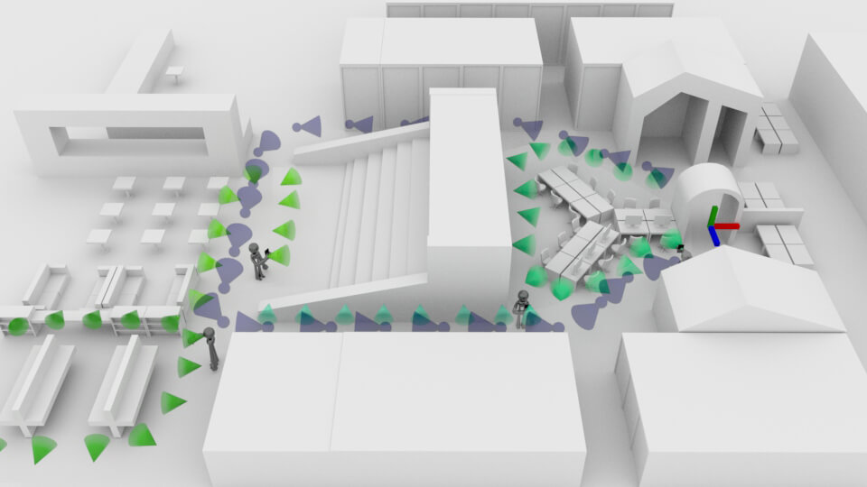
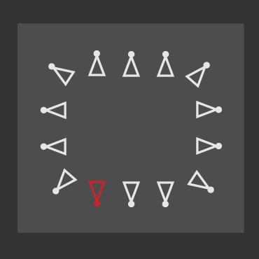
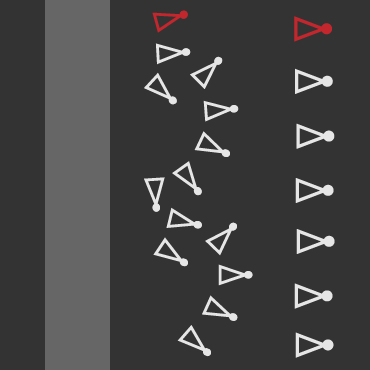

## Basic theory
Unlike previous versions, our mapping strategy is focused on collecting good quality data rather than a maximum of data. So the most important mapping instructions are:
* **Avoid blurry pictures**, make sure your camera (or mapping device such as drone, smart glasses, etc) correctly focuses.
* **Walk slowly and avoid sharp turns** to ensure that there are enough similarities between two frames 

## Where and what to map
__There is no physical limits to spaces you can map, but a couple of guidelines to keep in mind:__

* Similar to the way human eyes work, a camera can’t map or recognize a completely dark space
* Reflective surfaces will create different visual features based on your current viewpoint, which might not be correctly interpreted by our models
* Spaces with limited visual features such as a white wall or a hotel corridor with 200 similar doors will create issues. Again here, the human eye wouldn’t be able to know exactly where it is, computer vision works the same way. 
* Crowed places are not an issue but will require multiple updates. Similarly, objects that will frequently move, such as chairs, can be included in a bigger map that has at 4-5 updates. Even works with changing screens that are part of a bigger map.

The following drawing should cover most places you might be mapping. In this example, we’ve created a big map first, but you can decide to map smaller distinctive spaces and stitch them together later. The mapping technique is always the same, regardless of indoor and outdoor spaces.

While mapping and updating the map, what you’re trying to achieve is to **cover as many viewpoints as possible,** so that end-users will able to relocate with a high probability and accuracy. Remember, the more viewpoints the better accuracy and successful ratio!

As you can see below, the **first mapping in dark grey** was done to cover the main path. Along that path, multiple updates (different green colours) were added to include specific areas, **covering as many viewpoints as possible.** Our current model can estimate a relocation pose request up to 30° different from the dataset. Above that, the only solution to guarantee a successful relocation is a map update. 

Warning: if you pause your mapping, remember to start over where you took the last frame! If there is no overlap between 2 frames, both relocation and SFM algorithms won’t be able to work.

## How to get a good coverage

Here's a table explaining how to properly map different spaces. The red icon shows where the mapping started.

| Type of space | Coverage strategy |
|:-:|:-:|
| **Small room** |  |
| **Big/multiple rooms**  |   |
|  **Streets/outdoor spaces** |   |
|  **Large open areas** |   |
|  **Walls/Flat surfaces** |  |
|  **Point of interest** |  |

## Video

A quick video to explain the common mapping mistakes is available here.

