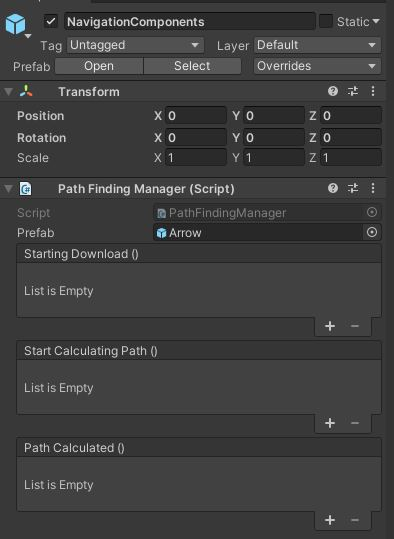
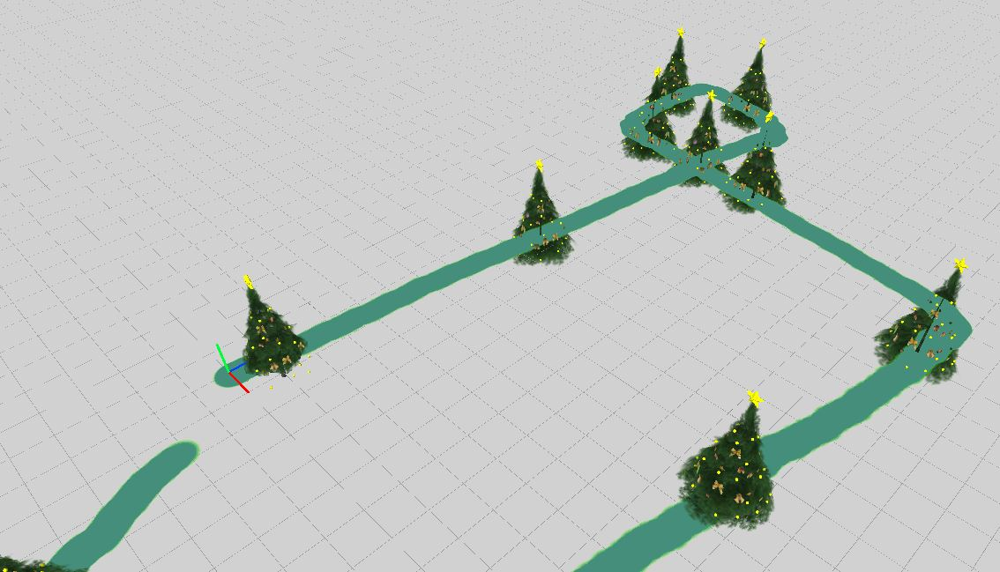
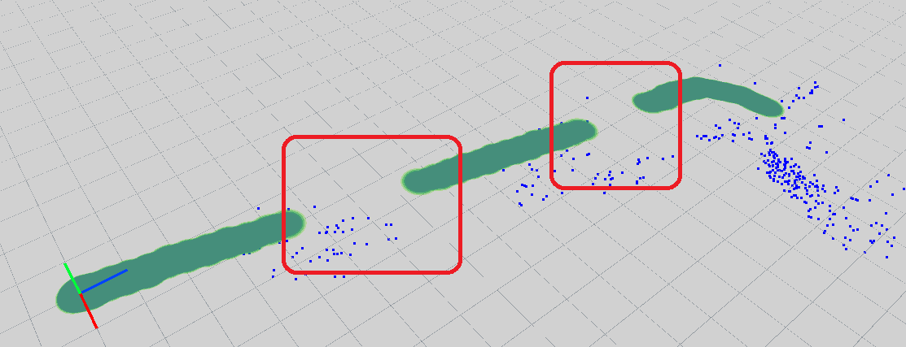
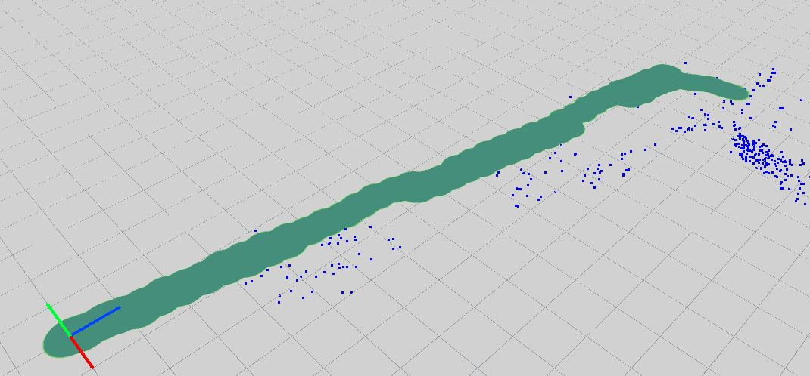

# Stardust navigation components
Since version 0.2 the Stardust SDK includes a navigation component.

## Principle
The mapping system automatically generates a navigable area based on the datas you sent. So the **more you map/update, the better your navigation will be**.

Navigations targets are destinations that the user can navigate to in your map. They can be defined either in the mapper samples or in the editor.

The editor will display the navigable area so you can easily see what areas you can go to and what areas you should update. 

**Note** You can setup your target while the map is training.

## Unity SDK
### NavigationComponents prefab
The Navigator component prefab is separated from the other prefab because not all use cases for stardust require navigation. If you do not need navigation in your relocation scene, you don't need to add it. What you will need however is a prefab for drawing the path.



### Pathfinding manager
The pathfinding manager is the main component responsible for calculating paths to destination. As every basic component it's a singleton that you can get with the following command.
```cs
PathFindingManager  pathfindingManager = PathFindingManager.Instance;
```

### Events

```cs
public void Start(){
    PathFindingManager  pathfindingManager = PathFindingManager.Instance;

    //Triggered when the navigation data download starts
    pathfindingManager.onStartingNavigationDatasDownload.AddListener(DownloadStarted);
    
    //Triggered when the navigation data downlad is finished
    pathfindingManager.onNavigationDatasReady.AddListener(PathFindingReady);
 
    //Triggered when the system starts calculating pathfinding
    pathfindingManager.onStartCalculatingPath.AddListener(StartPathfinding);

    //Triggered when the system had finished calculating pathfinding
    pathfindingManager.onPathCalculated.AddListener(PathFindingCalculated);
}

//Called when targets have been retrieved
private void PathFindingReady(List<ITarget> allTargets)
{
    //Display the name of every target
    for(int i=0;i<allTargets.Count;i++){
        Debug.Log(allTargets[i].name);
    }
}

private void StartPathfinding(){
    Debug.Log("Pathfinding calculation started");
}

private void PathFindingCalculated(IGraphNode startingPosition){
    Debug.Log("Pathfinding calculation finished");
}
```

### Display path to target
Once you selected a target you can just show the path to the target using the following code.
```cs
pathfindingManager.ShowPathToTarget(target);
```

This will automatically find the shortest path from your position to the designated target. Again this only works in navigable areas defined in mapping/update.

**Note** Path to target will automatically generate the prefabs you setup as a parameter in the **PathfindingManager** separated by 0.5m by default, you can specify the distance yourself using the second parameter of __ShowPathToTarget__

## Editor
You can open any map on the editor and select the navigation icon to switch to navigation mode


Once the navigation icon is selected you will see the navigable area as a green overlay.



### Known issues
In some cases (for example if the phone slam isn't good enough) the mapping has somme issues and you can end up with a map with the following path:



This makes the map impossible to navigate (navigation can freeze), all path should be somehow connected by them. In order to solve this issue you should update your map to cover the gaps. 




### Note
You can put a target anywhere you want but be aware that if you do not put your target on an navigable area the pathfinding algorithm can't guarantee the correct result of your navigation. If you want to make an area navigable just your map.
