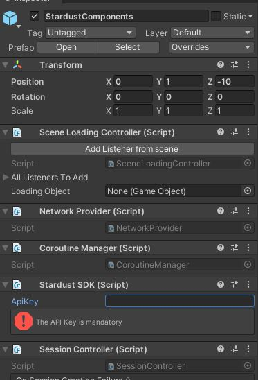

# Quick start

## Prerequesite
The SDK requires you to have a **valid Stardust** account. You can apply for a developer account for free [here](https://stardust.neogoma.com/).

## Compatibility
- Unity 2020.2.x or higher
- ARFoundation 4.1.5 or higher (Unity package)
- AR subsystems 4.1.5 or higher (Unity package)
- Unity ARKit plugin 4.1.5 or higher (Unity package)
- Unity ARCore XR plugin 4.1.5 or higher (Unity package)

## Supported devices
- All IPhones compatible with ARKit
- All Android phones compatible with ARCore ([list of compatible phones](https://developers.google.com/ar/discover/supported-devices))

## Run the demo
### Clone the project
First clone the repository on your drive.

```bash
git clone https://github.com/Neogoma/stardust-SDK.git
```

### Scenes breakdown
The example is composed of 4 scenes
- **SelectionScene** to select the operation to execute
- **Mapping scene** to create a new map and send the datas of the new map to the Stardust servers
- **Update scene** to update a map with new datas. The map needs to be generated before you can update it.
- **Relocation scene** to relocate into a map.

**Note** In your project you can do every operations in the same scene but we separated them to illustrate how each process works.

### Setup your developer token
You can find your developer token on the [dashboard](https://stardust.neogoma.com/profile)

Open the projet and setup your developer token in the 3 scenes:
- Mapper (this scene is used to map an area).
- Relocation (this scene is used to relocate/navigate into an area).
- Updater (this scene is used to update a map with new datas).

The token should be entered in the **StardustComponents** prefab



Once you've setup the API token on the 3 scenes you can build and run the example project


