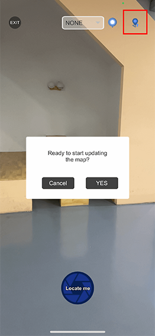

### Update your maps
Map updates are critical to anticipate the changes in your physical environment. As with most Machine Learning models, the more you map, the more you feed the model, hence the better relocation results. 
There is no limit to the number of updates you can run. Just make sure you’re not over your max number of pictures per map. On the Stardust world-scale AR app, the update button on the relocate/update scene is only visible after successfully relocating. From there on, just continue your mapping as indicated above. 
Remember, updating a map has 2 objectives:

* Covering areas that have not been mapped, with **as many viewpoints as possible**
* Feeding the ML model with more data from a mapped space, **anticipating changes in the physical environment.** 

Lastly, remember to click TRAIN when you are done with a map update, otherwise the model won’t take into account your updates!

