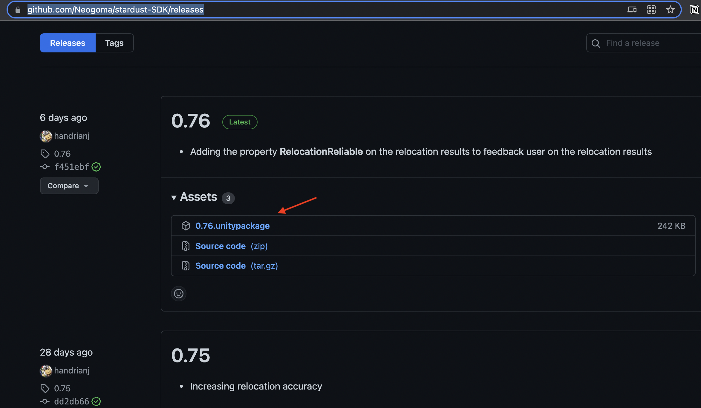

# Stardust upgrade guide

## Upgrade from 0.2/0.3 to 0.5

- Update to Unity 2020.2.x
- Update to ARFoundation 4.1.5 (Unity package)
- Update to AR subsystems 4.1.5 (Unity package)
- Update to Unity ARKit plugin 4.1.5 (Unity package)
- Update to Unity ARCore XR plugin 4.1.5 (Unity package)

### MapRelocationManager major change

- **MatchingPosition** has been renamed to **RelocationResults**
- **MapRelocationManager** __onPositionFound__ event now returns 2 objects: **RelocationResults** and **CoordinateSystem**

## Upgrade from 0.1x to 0.2

### Before importing the package
- Delete the **hobodream-sdk** from your project

### After importing the package
- You can delete the old **StardustComponents** and **StardustComponentsNoAutoLogin** from your project.
- Import the prefab **StardustComponents** from the new SDK in your scene.
- Import the prefab **HobodreamComponents** from the new SDK in your scene.
- Get your developer api key from the [dashboard](https://stardust.neogoma.com/profile).
- Fill the API key into the __Stardust SDK__ script of the **StardustComponents** prefab.
- For better naming conventions **ALL** Uunity events have been renamed with the "on" prefix for example __dataCapturedSucessfully__ has been renamed to __onDataCapturedSucessfully__. Just rename all your event refrences with the prefix "on"

## Updating with a newly released package

In order to update your sdk to a newer release version all you have to do is download the new release version package and import it into unity. You don't need to delete the previous package as Unity replaces only the files that changed.

### Downloading the latest release package

- Go over to our SDK repository [releases](https://github.com/Neogoma/stardust-SDK/releases).
- Click on the latest **.unitypackage** file to download the unity package.

- Then import the package into your Unity project.
- Click "All" and "Import" Unity should replace any files with changes or add new files to the existing package.

### Troubleshooting 

If you're having issues with updating your package or you're using an older version of the package it's recommended that you delete the **Neogoma** folder entirely from your project and then import the package.
